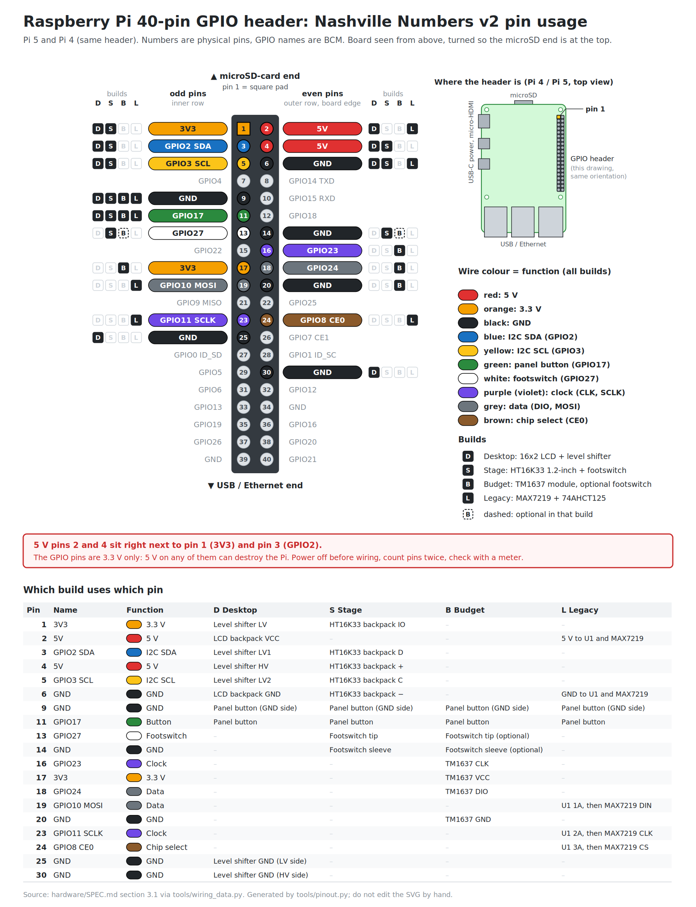

# Wiring Reference

See [`hardware/wiring/README.md`](../hardware/wiring/README.md) for the
wiring diagrams and pin-by-pin tables of every build, and
[`hardware/SPEC.md` §3](../hardware/SPEC.md#3-electrical-design) for the
design rules behind them.

