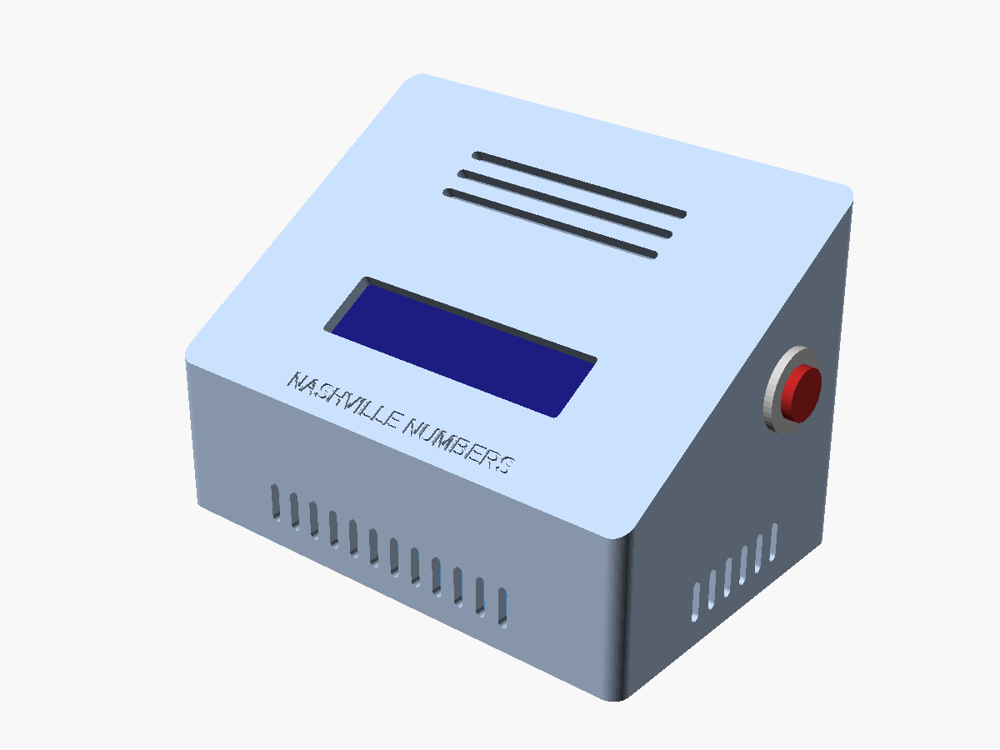
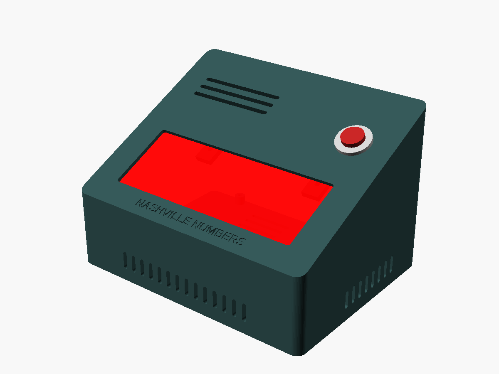
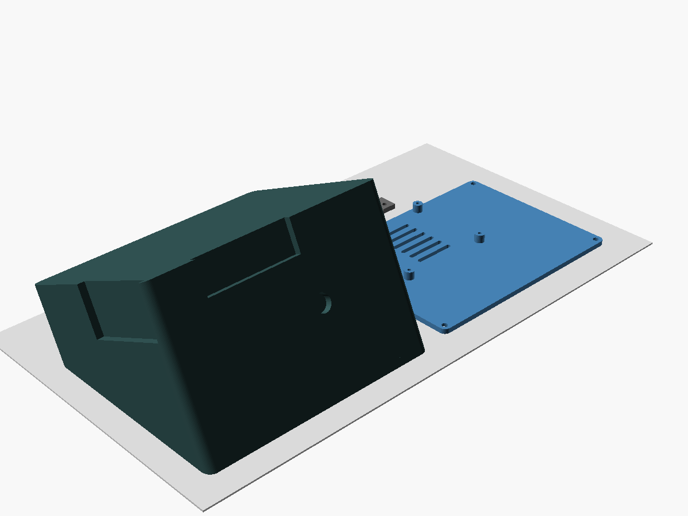
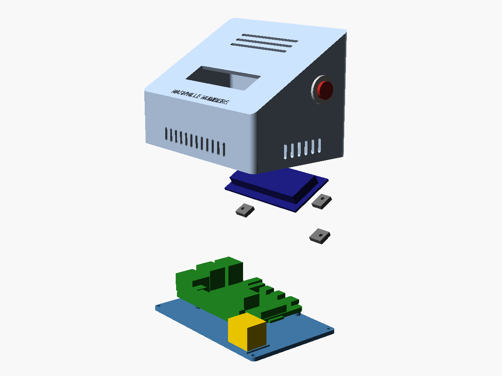
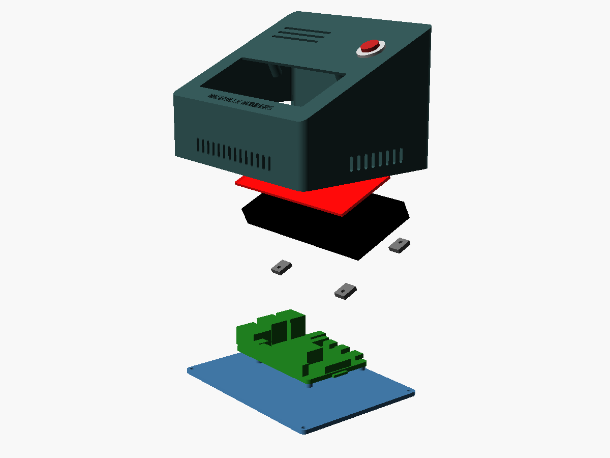
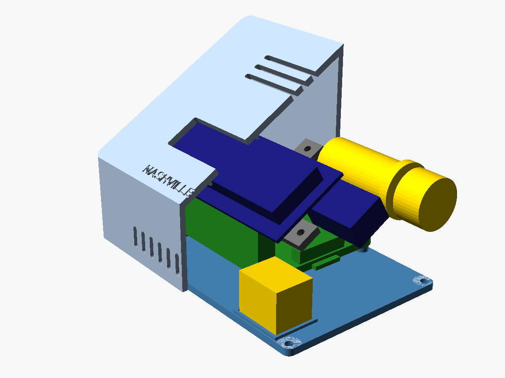
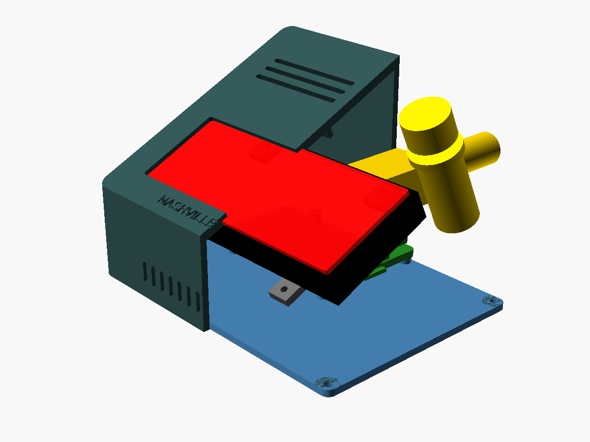
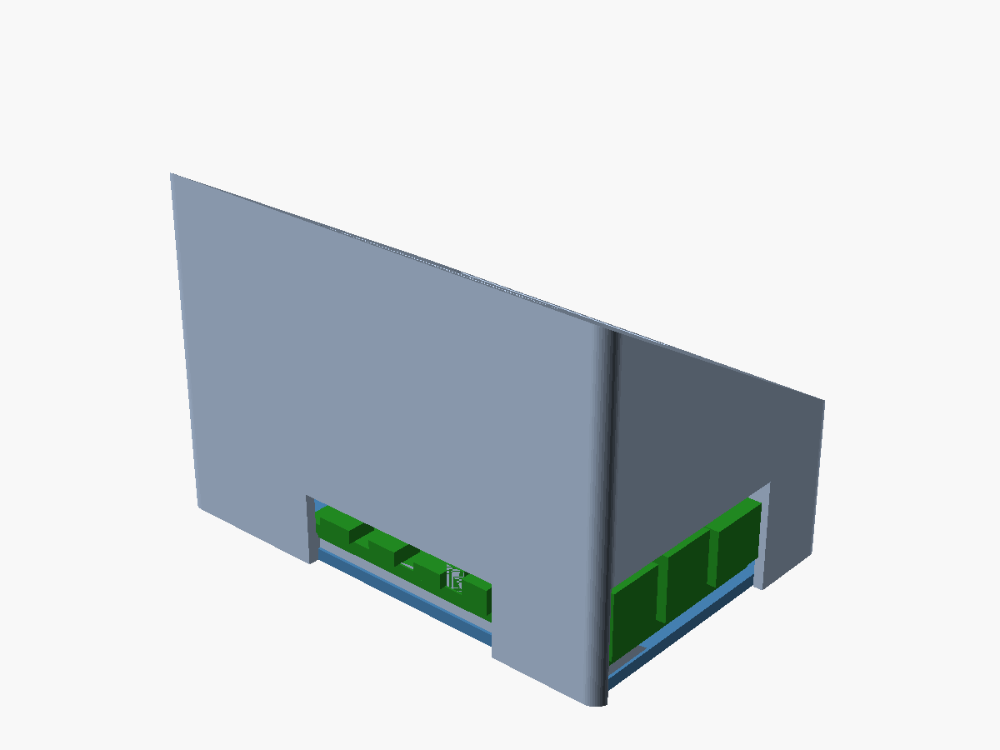
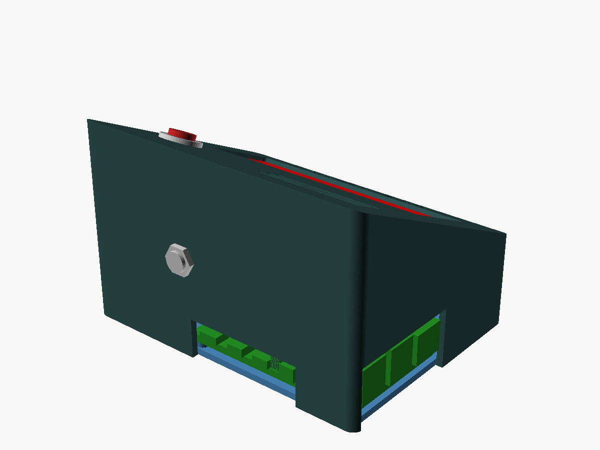

# Enclosures

Two 3D-printable enclosures, both a sloped wedge around a Raspberry Pi 5 or
Pi 4:

| | Desktop LCD case | Floor wedge |
|---|---|---|
| Builds | Desktop | Stage, Budget |
| Display | 16x2 LCD with I2C backpack | Adafruit 1.2" 7-segment (HT16K33), or a 0.56" / 0.36" TM1637 module, behind a red filter |
| Controls | 16 mm button (right side) | 16 mm button (face), 1/4" footswitch jack (back) |
| Outside | 125 x 82 mm, 38 to 85 mm tall, face at 30° | 142 x 108 mm, 42 to 92 mm tall, face at 25° |
| Source | [`desktop_lcd_case.scad`](desktop_lcd_case.scad) | [`stage_wedge.scad`](stage_wedge.scad) |

<p align="center">
  
  
</p>

Each case is a **shell** (walls and face in one piece) and a flat **base
plate** that carries the Pi. The display is held against the inside of the
face by small **clamp tabs**, so it does not matter where your module's own
mounting holes are. Three M3 screws go up through the base into heat-set
inserts in the shell. The Pi's ports come out through notches in the left
and back walls.

All parts print without supports on a 180 x 180 mm bed. CI checks every
change: each part must be a single watertight body that fits the printer,
and nothing may collide with a Pi 4 or Pi 5 (with the Active Cooler, plugs
in every port and jumpers on the GPIO header), the display and its wiring,
the button, the jack or the other printed parts.

## Files to print

All STLs are already in their print orientation: import them and slice.

| Build | Shell | Base | Clamp tabs | Red filter (cut) |
|---|---|---|---|---|
| Desktop | [`desktop_lcd_case-shell.stl`](stl/desktop_lcd_case-shell.stl) | [`desktop_lcd_case-base.stl`](stl/desktop_lcd_case-base.stl) | [`desktop_lcd_case-clamps.stl`](stl/desktop_lcd_case-clamps.stl) (3) | - |
| Stage, Adafruit 1.2" | [`stage_wedge-ht16k33_12-shell.stl`](stl/stage_wedge-ht16k33_12-shell.stl) | [`stage_wedge-base.stl`](stl/stage_wedge-base.stl) | [`stage_wedge-ht16k33_12-clamps.stl`](stl/stage_wedge-ht16k33_12-clamps.stl) (4) | 116 x 46 mm: [DXF](cut/stage_wedge-ht16k33_12-filter.dxf), [SVG](cut/stage_wedge-ht16k33_12-filter.svg) |
| Budget, TM1637 0.56" | [`stage_wedge-tm1637_056-shell.stl`](stl/stage_wedge-tm1637_056-shell.stl) | [`stage_wedge-base.stl`](stl/stage_wedge-base.stl) | [`stage_wedge-tm1637_056-clamps.stl`](stl/stage_wedge-tm1637_056-clamps.stl) (2) | 54 x 23 mm: [DXF](cut/stage_wedge-tm1637_056-filter.dxf), [SVG](cut/stage_wedge-tm1637_056-filter.svg) |
| Budget, TM1637 0.36" | [`stage_wedge-tm1637_036-shell.stl`](stl/stage_wedge-tm1637_036-shell.stl) | [`stage_wedge-base.stl`](stl/stage_wedge-base.stl) | [`stage_wedge-tm1637_036-clamps.stl`](stl/stage_wedge-tm1637_036-clamps.stl) (2) | 35 x 19 mm: [DXF](cut/stage_wedge-tm1637_036-filter.dxf), [SVG](cut/stage_wedge-tm1637_036-filter.svg) |

Check your display module against the case before you print
([below](#check-your-modules)).

## Print settings

| Setting | Value |
|---|---|
| Material | Floor wedge: **PETG** (tougher, and survives a hot car). Desktop case: PLA or PETG. |
| Nozzle, layer height | 0.4 mm, 0.2 mm |
| Walls | 3 perimeters (the 2.5 to 3 mm walls then print solid), 5 top and bottom layers |
| Infill | 20 % |
| Supports | **none** |
| Adhesion | no brim needed: the shell prints on its face, the base on its underside |
| Filament | desktop about 130 g, floor wedge about 210 g |

<p align="center">
  
</p>

The **shell prints face-down**: the display face lies on the bed and the
open bottom points up, so the face comes out as smooth (or textured) as your
build plate, and the port notches, which are open at the rim, need no
bridges. The side walls stand vertical; the front and back walls lean by
the face angle. Keep elephant-foot compensation on so the engraved lettering
on the face stays crisp.

## Hardware

| Part | Desktop | Stage | Budget |
|---|---:|---:|---:|
| M3 heat-set insert for a 4.0 mm hole, up to 6 mm long (CNC Kitchen / Ruthex M3 x 5.7) | 3 | 3 | 3 |
| M3 x 8 screw, button or socket head (6 to 10 mm long work) | 3 | 3 | 3 |
| M2.5 x 8 screw, pan or button head, self-tapping or machine screw | 7 | 8 | 6 |
| Adhesive rubber bumper, up to 13 mm diameter | 4 | 4 | 4 |
| Double-sided foam tape, 20 x 15 mm (level shifter) | 1 | - | - |
| 2 mm red transparent acrylic filter | - | 1 | 1 (optional) |
| Hook-and-loop or Dual Lock, 25 x 60 mm (pedalboard) | - | 2 (optional) | 2 (optional) |

Four of the M2.5 screws hold the Pi; the others hold the clamp tabs. To do
without heat-set inserts, set `closure = "selftap"` in `lib/wedge.scad`,
rebuild the STLs ([Customising](#customising)) and use M3 x 10
thread-forming screws for plastic. The complete parts lists, electronics
included, are in the [BOM](../bom/README.md).

## Assembly

<p align="center">
  
  
</p>

Wire and test everything on the bench first ([wiring guide](../wiring/README.md)):
it is much easier to fix a connection before it is inside a case. Flash the
microSD card and put it in the Pi before assembly; the card slot is inside
the case, so changing the card means taking the base off.

1. **Inserts.** Press the three M3 heat-set inserts into the corner posts
   from the open bottom of the shell with a soldering iron (about 220 °C for
   PLA, 240 °C for PETG). Keep them square and stop flush with the end of the
   post.
2. **Filter** (floor wedge). Peel the protective film off and lay the filter
   into the pocket behind the window, from inside. Hold it with a few small
   dots of clear silicone, epoxy or thin double-sided tape at its edges.
   Do not use superglue: its fumes fog acrylic.
3. **Display.** Lay the module into the face from inside, digits or screen
   facing the window. The LCD's bezel drops into the ridge around the
   window; a 7-segment module presses on the filter. Put the clamp tabs over
   the module's edges and screw each one into its boss with an M2.5 x 8
   screw. Tighten until the tab holds the module firmly, no further: the
   tabs flex a little by design, and too much force bends the module.
4. **Button.** Push the 16 mm button through its hole (desktop: right side
   wall; floor wedge: top right of the face) and tighten its nut from inside.
5. **Footswitch jack** (floor wedge). Solder R1 and C1 onto the jack first
   ([wiring guide](../wiring/README.md#footswitch-jack-r1-and-c1)), then
   fit it into the back wall with the nut outside. Tie the leads to the jack
   frame with a small cable tie for strain relief.
6. **Pi.** Fit the Active Cooler (Pi 5) or the heatsink (Pi 4). Hold the
   base the way it sits in the case: the standoffs are at the back left.
   Screw the Pi onto them with four M2.5 x 8 screws, USB and Ethernet facing
   left, USB-C and HDMI facing the back. Desktop: stick the level shifter
   inside the small ridge at the front right of the base with foam tape.
7. **Wire up** the display, the button and the jack as in the wiring guide.
   Leave enough slack in the jumpers to stand the shell next to the base
   while you plug them in. For a stage unit, keep the jumper housings from
   working loose: a dab of hot glue across each header row, or a strip of
   Kapton tape, holds them and peels off later.
8. **Close.** Lower the shell over the base so the ports line up with the
   notches in the left and back walls, turn the case over, and drive the
   three M3 x 8 screws through the base into the inserts.
9. **Feet.** Stick the bumpers into the four round recesses. For a
   pedalboard, put hook-and-loop or Dual Lock into the two long recesses of
   the floor wedge base instead.

<p align="center">
  
  
</p>

Power (USB-C) and HDMI come out of the back wall, the USB audio interface
and Ethernet out of the left wall; on the floor wedge the footswitch jack is
also at the back, so no cable leaves the front.

<p align="center">
  
  
</p>

Airflow: air moves through the slots low in the front and right walls and
in the base, and through the slots in the face right above the Pi and its
cooler. Keep the face slots uncovered.

## Check your modules

Displays from different vendors differ by a few millimetres. The cases are
drawn for these sizes (in [`lib/ghosts.scad`](lib/ghosts.scad)); measure
yours with calipers:

| Module | What to measure | Drawn for |
|---|---|---|
| 16x2 LCD | PCB | 80 x 36 x 1.6 mm |
| | metal bezel (it must drop into the ridge, which is 0.4 mm larger all round) | 71.2 x 24.2 mm, 7.0 mm tall |
| | backpack, I2C header pointing sideways | 41.6 x 19.1 mm, 11 mm tall |
| Adafruit 1.2" 7-segment | outline, depth from the digit face to the back of the PCB | 120 x 50 mm, 13 mm |
| TM1637 0.56" | PCB outline, depth from the digit face to the back of the PCB | 50.5 x 25 mm, 10 mm |
| TM1637 0.36" | same | 42 x 24 mm, 9 mm |

If yours differ, change the numbers in `lib/ghosts.scad` (`lcd_pcb`,
`lcd_bezel`, `lcd_backpack`, or the `sevenseg_dims` entry), then run the
checks and rebuild the STLs as described below. A module up to about
0.5 mm thicker than drawn is fine as it is, because the clamp tabs flex; if
it is thinner, put a strip of foam tape between each tab and the module.

## Customising

The parameters at the top of each `.scad` file change the case: size
(`W`, `D`, `H`), face angle (`angle`), wall and face thickness, the
display position (`lcd_x`, `lcd_s` / `disp_x`, `disp_s`), the button and
jack positions and the vent slots. In `lib/wedge.scad`, `closure` selects
heat-set inserts (`"insert"`) or M3 thread-forming screws (`"selftap"`).
`stage_wedge.scad` picks the display with `display`.

Open a file in OpenSCAD to see the assembly. The `part` variable selects
what is shown or exported:

| `part` | |
|---|---|
| `assembly` | the finished case (default) |
| `cutaway` | shell cut through the display, everything inside shown |
| `exploded` | assembly order |
| `print_layout` | the printed parts in their print orientation |
| `shell`, `base`, `clamps` | one printed part, in print orientation (what the STLs are) |
| `filter` | 2D filter outline (floor wedge) |
| `ghosts_pi4`, `ghosts_pi5`, `ghost_display`, `ghost_controls` | the keep-out models the checks use |

After a change, check the design and rebuild the files:

```bash
python3 tools/check_cad.py      # fit checks (needs numpy, scipy, trimesh, manifold3d)
python3 tools/build.py          # STLs, filter DXF/SVG, renders
```

`check_cad.py` exports every part with OpenSCAD and fails if a part is not a
single watertight body, does not fit a 180 mm printer, or intersects the Pi
(4 or 5), the display, the controls, their plugs and wiring, or another
part. `build.py` needs OpenSCAD 2021.01 or newer; on a machine without a
display it runs itself under `xvfb-run` for the renders.

## Layout

```
desktop_lcd_case.scad   desktop case
stage_wedge.scad        floor wedge (all display variants)
lib/common.scad         screw, insert and clearance sizes; shape helpers
lib/wedge.scad          the shared shell / base / closure / clamp-tab design
lib/ghosts.scad         keep-out models of the Pi, displays, button, jack
stl/                    print-ready parts (generated)
cut/                    filter outlines (generated)
renders/                images (generated)
tools/check_cad.py      fit and printability checks (run by CI)
tools/build.py          regenerates stl/, cut/ and renders/
```
