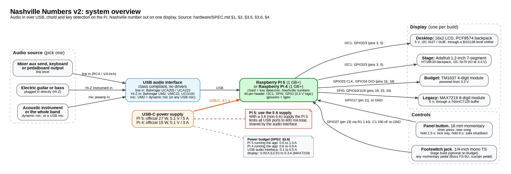
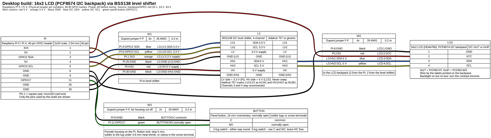
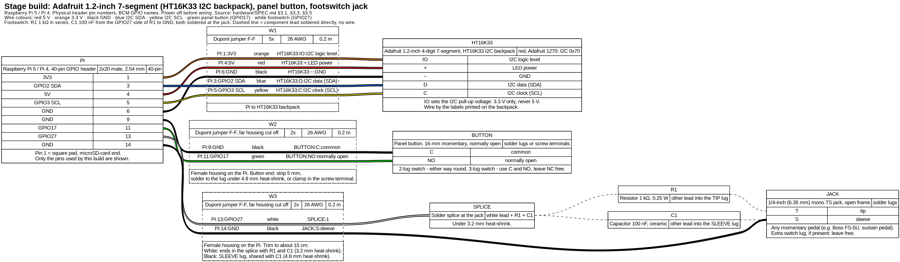
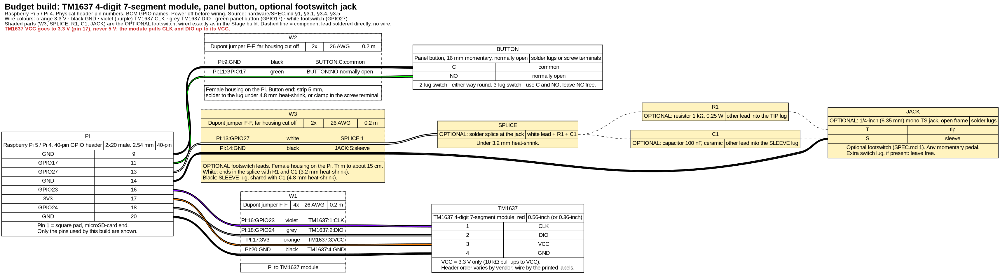
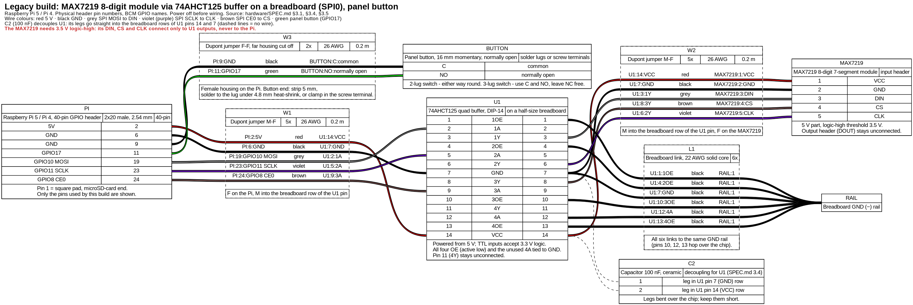

# Wiring guide: Nashville Numbers v2

How to wire each Nashville Numbers v2 build: a Raspberry Pi 5 or Pi 4 (1 GB+),
a USB audio interface, one display and the controls. Everything here follows
[`../SPEC.md`](../SPEC.md) section 3 (electrical design), which is the source of truth.
If this guide and SPEC.md ever disagree, SPEC.md wins: fix the sources here and rebuild
([Rebuilding the diagrams](#rebuilding-the-diagrams)).

Pin numbers are **physical header pins** (1 to 40). GPIO numbers are **BCM**.

Every table below lists the wires pin by pin, so you can wire a build without reading the
diagrams. The diagrams show the same wires.

## Contents

- [Which diagram is for which build](#which-diagram-is-for-which-build)
- [Safety rules](#safety-rules-read-before-wiring)
- [Wire colour scheme](#wire-colour-scheme)
- [Header pinout and orientation](#header-pinout-and-orientation)
- [System overview](#system-overview)
- Builds: [Desktop](#desktop-build-16x2-lcd) ·
  [Stage](#stage-build-ht16k33-12-inch-7-segment-and-footswitch) ·
  [Budget](#budget-build-tm1637) · [Legacy](#legacy-build-max7219-via-74ahct125)
- [Soldering the button, the jack and the inline resistor](#soldering-the-button-the-jack-and-the-inline-resistor)
- [Bring-up and tests](#bring-up-and-tests)
- [Wire and cut lists (for the BOM)](#wire-and-cut-lists-for-the-bom)
- [Rebuilding the diagrams](#rebuilding-the-diagrams)
- [Notes and open points against SPEC.md](#notes-and-open-points-against-specmd)

## Which diagram is for which build

| Build | Display | Enclosure | Wiring diagram | Harness source | Auto-BOM |
|---|---|---|---|---|---|
| **Desktop** | 16x2 character LCD, PCF8574 I2C backpack, BSS138 level shifter | `desktop_lcd_case.scad` | [SVG](desktop_lcd.svg), [PNG](desktop_lcd.png) | [`desktop_lcd.yml`](desktop_lcd.yml) | [`desktop_lcd.bom.tsv`](desktop_lcd.bom.tsv) |
| **Stage** | Adafruit 1.2" 4-digit 7-segment, HT16K33 backpack (red), footswitch jack | `stage_wedge.scad` | [SVG](stage_ht16k33.svg), [PNG](stage_ht16k33.png) | [`stage_ht16k33.yml`](stage_ht16k33.yml) | [`stage_ht16k33.bom.tsv`](stage_ht16k33.bom.tsv) |
| **Budget** | TM1637 4-digit 7-segment module, 0.56" (or 0.36"), red; optional footswitch jack | `stage_wedge.scad` with `display = "tm1637_056"` | [SVG](budget_tm1637.svg), [PNG](budget_tm1637.png) | [`budget_tm1637.yml`](budget_tm1637.yml) | [`budget_tm1637.bom.tsv`](budget_tm1637.bom.tsv) |
| **Legacy** | MAX7219 8-digit module via a 74AHCT125 buffer (supported in software, no enclosure) | none | [SVG](legacy_max7219.svg), [PNG](legacy_max7219.png) | [`legacy_max7219.yml`](legacy_max7219.yml) | [`legacy_max7219.bom.tsv`](legacy_max7219.bom.tsv) |

For every build: [header pinout](pinout.svg) ([PNG](pinout.png)) and
[system block diagram](system_block_diagram.svg) ([PNG](system_block_diagram.png)).
The USB audio interface and the power supply are the same for all builds
(SPEC.md sections 2 and 4) and plug into the Pi's USB and USB-C ports; they need no wiring.

All builds have the panel button on GPIO17. The footswitch jack is part of the Stage build
and optional on the Budget build (both use the stage wedge, which has the jack hole).

## Safety rules (read before wiring)

1. **Power off before wiring.** Unplug the USB-C supply before you connect, move or remove
   any jumper. A jumper that slips while the Pi is live can touch 5 V to a GPIO pin.
2. **The Pi's GPIO pins are 3.3 V only.** They are not 5 V tolerant. Only pins 1 and 17
   (3.3 V), 2 and 4 (5 V) and the GND pins are power pins; no other pin may ever see more
   than 3.3 V, not even through a pull-up resistor.
3. **5 V and 3.3 V sit next to each other.** Pin 1 (3V3) is beside pin 2 (5V), and pin 4
   (5V) is beside pin 3 (GPIO2 SDA). Count from pin 1, the square pad at the microSD-card
   end, and check every red wire twice. 5 V on pin 1 or pin 3 destroys the Pi.
4. **Why the LCD needs the level shifter.** The PCF8574 backpack must run on 5 V (the
   HD44780 contrast and the backlight need it), and it has 4.7 kΩ pull-ups from SDA and SCL
   to that 5 V. Wired straight to the Pi, those pull-ups fight the Pi's own 1.8 kΩ pull-ups
   to 3.3 V and hold both bus lines at about 3.8 V, above what the Pi's pins may see. The
   BSS138 board keeps the Pi side (LV) at 3.3 V and the LCD side (HV) at 5 V.
   **LV goes to 3.3 V (pin 1), HV to 5 V (pin 4). Never swap them.**
5. **The TM1637 runs on 3.3 V (pin 17), never 5 V.** The module has 10 kΩ pull-ups from
   CLK and DIO to its own VCC, so on 5 V it would pull GPIO23 and GPIO24 up to 5 V. Red
   digits are bright enough at 3.3 V; blue and white ones are not, so buy red.
6. **The MAX7219 needs the 74AHCT125.** It is a 5 V chip whose logic-high threshold (VIH)
   is 3.5 V, so the Pi's 3.3 V signals are not a reliable "high". The 74AHCT125 runs on 5 V,
   accepts 3.3 V logic on its inputs and drives 5 V into the MAX7219. Nothing goes back
   from the MAX7219 to the Pi: leave the module's DOUT header and the Pi's MISO (pin 21)
   unconnected.
7. **HT16K33 backpack: `IO` to 3.3 V (pin 1), `+` to 5 V (pin 4).** `IO` sets the I2C
   pull-up voltage; 5 V on `IO` would pull SDA and SCL to 5 V.
8. **Check before the first power-on:** continuity and short-circuit checks in
   [Bring-up and tests](#bring-up-and-tests).
9. **Use the right supply.** Pi 5: official 27 W (5.1 V / 5 A). Pi 4: official 15 W
   (5.1 V / 3 A). With a 3 A supply the Pi 5 limits all its USB ports together to 600 mA,
   and the audio interface has to live within that.

## Wire colour scheme

One colour per signal, the same in every build and every diagram. A signal keeps its colour
through the level shifter and the 74AHCT125 (for example SDA is blue on both sides of the
level shifter, and SPI MOSI is grey from the Pi to U1 and from U1 to the MAX7219 DIN).
The ten colours are exactly those of a standard 40-way "rainbow" Dupont ribbon (4 of each
colour); no build needs more than 4 wires of one colour, so one ribbon wires any build.

<!-- BEGIN GENERATED: colour scheme -->
| Wire colour | Signal | Header pins | WireViz code |
|---|---|---|---|
| **red** | 5 V supply | 2, 4 | `RD` |
| **orange** | 3.3 V supply | 1, 17 | `OG` |
| **black** | ground | 6, 9, 14, 20, 25, 30 | `BK` |
| **blue** | I2C data (GPIO2), both sides of the level shifter | 3 | `BU` |
| **yellow** | I2C clock (GPIO3), both sides of the level shifter | 5 | `YE` |
| **green** | panel button (GPIO17) | 11 | `GN` |
| **white** | footswitch (GPIO27), from the header to the R1/C1 splice | 13 | `WH` |
| **purple (WireViz prints *violet*)** | TM1637 CLK (GPIO23); SPI SCLK (GPIO11) to MAX7219 CLK | 16, 23 | `VT` |
| **grey** | TM1637 DIO (GPIO24); SPI MOSI (GPIO10) to MAX7219 DIN | 18, 19 | `GY` |
| **brown** | SPI CE0 (GPIO8) to MAX7219 CS | 24 | `BN` |
<!-- END GENERATED: colour scheme -->

## Header pinout and orientation

[](pinout.svg)

- **Pin 1 is the square pad at the microSD-card end of the header**, on the inner row.
  Odd pins (1, 3 ... 39) are the inner row; even pins (2, 4 ... 40) are the outer row along
  the board edge, so pin 2 (5 V) is the corner pin at the board edge next to the microSD
  end. The Pi 4 and Pi 5 headers are identical.
- The drawing shows the board from above, turned so that the microSD end is at the top
  (inset on the right).
- SPEC.md section 2 reserves about 22 mm of free height above the header for the Dupont
  housings and the wire bend; keep it free (also next to the Pi 5 Active Cooler).

Which build uses which pin (same data as the drawing):

<!-- BEGIN GENERATED: pin usage -->
| Pin | Name | Function (wire colour) | Desktop | Stage | Budget | Legacy |
|---:|---|---|---|---|---|---|
| 1 | 3V3 | 3.3 V (orange) | Level shifter LV | HT16K33 backpack IO |  |  |
| 2 | 5V | 5 V (red) | LCD backpack VCC |  |  | 5 V to U1 and MAX7219 |
| 3 | GPIO2 SDA | I2C SDA (blue) | Level shifter LV1 | HT16K33 backpack D |  |  |
| 4 | 5V | 5 V (red) | Level shifter HV | HT16K33 backpack + |  |  |
| 5 | GPIO3 SCL | I2C SCL (yellow) | Level shifter LV2 | HT16K33 backpack C |  |  |
| 6 | GND | GND (black) | LCD backpack GND | HT16K33 backpack − |  | GND to U1 and MAX7219 |
| 9 | GND | GND (black) | Panel button (GND side) | Panel button (GND side) | Panel button (GND side) | Panel button (GND side) |
| 11 | GPIO17 | Button (green) | Panel button | Panel button | Panel button | Panel button |
| 13 | GPIO27 | Footswitch (white) |  | Footswitch tip | Footswitch tip (optional) |  |
| 14 | GND | GND (black) |  | Footswitch sleeve | Footswitch sleeve (optional) |  |
| 16 | GPIO23 | Clock (purple) |  |  | TM1637 CLK |  |
| 17 | 3V3 | 3.3 V (orange) |  |  | TM1637 VCC |  |
| 18 | GPIO24 | Data (grey) |  |  | TM1637 DIO |  |
| 19 | GPIO10 MOSI | Data (grey) |  |  |  | U1 1A, then MAX7219 DIN |
| 20 | GND | GND (black) |  |  | TM1637 GND |  |
| 23 | GPIO11 SCLK | Clock (purple) |  |  |  | U1 2A, then MAX7219 CLK |
| 24 | GPIO8 CE0 | Chip select (brown) |  |  |  | U1 3A, then MAX7219 CS |
| 25 | GND | GND (black) | Level shifter GND (LV side) |  |  |  |
| 30 | GND | GND (black) | Level shifter GND (HV side) |  |  |  |
<!-- END GENERATED: pin usage -->

Any GND pin would work for any ground wire. The GND pins above were chosen so that every
header pin has exactly one job across all builds (for example pin 14 is always the
footswitch sleeve and pin 20 always the TM1637 ground).

## System overview

[](system_block_diagram.svg)

A direct, clean signal (line out or DI) gives far better chord detection than a room mic.
Pick the interface by source (SPEC.md section 4): line in (Behringer UCA202 / UCA222) for a
mixer aux send, keyboard or pedalboard; a Hi-Z instrument input (Behringer UM2, UMC22,
UCG102) for guitar or bass plugged in directly; a mic preamp or a USB mic for acoustic
instruments or the whole band.

## Desktop build: 16x2 LCD

[](desktop_lcd.svg)

Harness: [`desktop_lcd.yml`](desktop_lcd.yml). SPEC.md sections 3.1, 3.2, 3.5.

<!-- BEGIN GENERATED: desktop_lcd wiring -->
| Cable | From | To | Wire colour | Notes |
|---|---|---|---|---|
| W1 | Pi pin 3 (GPIO2 SDA) | Level shifter LV1 | blue | I2C data, 3.3 V side |
| W1 | Pi pin 5 (GPIO3 SCL) | Level shifter LV2 | yellow | I2C clock, 3.3 V side |
| W1 | Pi pin 1 (3V3) | Level shifter LV | orange | low-side supply: 3.3 V, never 5 V |
| W1 | Pi pin 25 (GND) | Level shifter GND (LV side) | black |  |
| W1 | Pi pin 4 (5V) | Level shifter HV | red | high-side supply: 5 V |
| W1 | Pi pin 30 (GND) | Level shifter GND (HV side) | black |  |
| W2 | Pi pin 6 (GND) | LCD backpack GND | black |  |
| W2 | Pi pin 2 (5V) | LCD backpack VCC | red | 5 V for contrast and backlight |
| W2 | Level shifter HV1 | LCD backpack SDA | blue | I2C data, 5 V side |
| W2 | Level shifter HV2 | LCD backpack SCL | yellow | I2C clock, 5 V side |
| W3 | Pi pin 9 (GND) | Panel button, terminal C | black | either terminal; solder lug or screw terminal |
| W3 | Pi pin 11 (GPIO17) | Panel button, terminal NO | green | internal pull-up, pressed = low |
<!-- END GENERATED: desktop_lcd wiring -->

- **Level shifter (LS):** generic boards are marked `LV1 LV2 LV GND LV3 LV4` on the 3.3 V
  row and `HV1 HV2 HV GND HV3 HV4` on the 5 V row. Adafruit 757 marks the same pins `LV`,
  `A1`, `A2`, `GND` and `HV`, `B1`, `B2`, `GND`. Channels 3 and 4 stay free. Both GND pins
  go to GND (SPEC.md 3.2). Stick the board to the base plate with foam tape (pocket in the
  enclosure), LV row towards the Pi.
- **LCD backpack:** the 4-pin header is usually `GND VCC SDA SCL`; wire by the printed labels.
  It points sideways out of one end of the LCD; the housings need about 20 mm of room past
  the LCD board edge (SPEC.md 5.3).
- I2C address 0x27 (PCF8574T) or 0x3F (PCF8574AT). Adafruit's own LCD backpack uses an
  MCP23008 at 0x20 instead: set `display.lcd.expander` in the configuration. Most cheap
  modules use the Hitachi A00 character ROM (`charmap: "A00"`).

## Stage build: HT16K33 1.2-inch 7-segment and footswitch

[](stage_ht16k33.svg)

Harness: [`stage_ht16k33.yml`](stage_ht16k33.yml). SPEC.md sections 3.1, 3.3, 3.5.

<!-- BEGIN GENERATED: stage_ht16k33 wiring -->
| Cable | From | To | Wire colour | Notes |
|---|---|---|---|---|
| W1 | Pi pin 1 (3V3) | HT16K33 backpack IO | orange | sets the I2C pull-up level: 3.3 V only |
| W1 | Pi pin 4 (5V) | HT16K33 backpack + | red | LED power, 5 V |
| W1 | Pi pin 6 (GND) | HT16K33 backpack − | black |  |
| W1 | Pi pin 3 (GPIO2 SDA) | HT16K33 backpack D | blue | I2C data |
| W1 | Pi pin 5 (GPIO3 SCL) | HT16K33 backpack C | yellow | I2C clock |
| W2 | Pi pin 9 (GND) | Panel button, terminal C | black | either terminal; solder lug or screw terminal |
| W2 | Pi pin 11 (GPIO17) | Panel button, terminal NO | green | internal pull-up, pressed = low |
| W3 | Pi pin 13 (GPIO27) | Splice with R1 and C1, at the jack | white | white lead ends here; 3.2 mm heat-shrink |
| W3 | Pi pin 14 (GND) | Footswitch jack, sleeve lug | black | shares the lug with C1 |
| none | Splice (white lead) | R1 (1 kΩ), first lead | component lead, no wire | soldered together in the splice |
| none | R1 (1 kΩ), second lead | Footswitch jack, tip lug | component lead, no wire | resistor lead soldered into the lug |
| none | Splice (white lead) | C1 (100 nF), first lead | component lead, no wire | soldered together in the splice |
| none | C1 (100 nF), second lead | Footswitch jack, sleeve lug | component lead, no wire | capacitor lead soldered into the lug with the black lead |
<!-- END GENERATED: stage_ht16k33 wiring -->

- **Backpack pins** `IO`, `+`, `−`, `D`, `C`: wire by the printed labels. `IO` goes to
  3.3 V only. `+` feeds the LEDs from 5 V (boards made since 2023 have a boost converter and
  would also run from 3.3 V; this wiring keeps SPEC.md's 5 V). I2C address 0x70.
- A 2 mm red acrylic filter in front of the digits improves contrast under stage lights.
- **Footswitch jack:** 1/4-inch (6.35 mm) mono TS jack. Tip goes through R1 (1 kΩ) to
  GPIO27 (pin 13); sleeve goes to GND (pin 14); C1 (100 nF ceramic) goes from the GPIO27
  side of R1 to GND. R1 and C1 are soldered at the jack: the white lead ends in a splice
  with one lead of R1 and one lead of C1, R1's other lead goes into the tip lug and C1's
  other lead into the sleeve lug with the black lead. No external pull-up: the Pi's internal
  pull-up holds the line high. Any momentary pedal works (Boss FS-5U, a keyboard sustain
  pedal ...); the software learns the pedal polarity at start-up, so normally-open and
  normally-closed pedals both work. How to build it:
  [Soldering](#footswitch-jack-r1-and-c1).

### Why the footswitch has R1 (1 kΩ) and C1 (100 nF)

The jack is the only GPIO input that leaves the box, and on stage someone will sooner or
later plug a guitar cable or a line-level lead into it. An instrument or line signal swings
below 0 V and can swing above 3.3 V; either way the GPIO pin's protection diodes start to
conduct. **R1** (1 kΩ in series) limits that current to about a milliampere for a normal
line level (+4 dBu is about 1.7 V peak), which the pin survives, and it softens static
discharges from the plug.

**C1** (100 nF from the GPIO27 side of R1 to GND) turns R1 into an RC low-pass filter
(1 kΩ × 100 nF = 0.1 ms, corner about 1.6 kHz). The pedal cable can be several metres of
wire lying next to amps and lighting cables, and the pin itself is only held high by the
Pi's weak internal pull-up, so hum, radio pick-up and switching spikes would otherwise
reach it; R1 and C1 filter them out, and C1 also absorbs what is left of a static discharge
after R1.

Neither costs anything in function. Pressing the pedal empties C1 through R1 in well under
a millisecond, and the pin still settles at about 3.3 V × 1 k / 51 k ≈ 0.06 V with the
internal pull-up (tens of kΩ, roughly 50 kΩ), far below the logic-low threshold (about
0.8 V). On release the pull-up recharges C1 with a time constant of about 50 kΩ × 100 nF
= 5 ms, so the line is high again within a few milliseconds, much faster than a foot. A
much larger R1 (10 kΩ or more) would lift the "pressed" level towards the threshold.

## Budget build: TM1637

[](budget_tm1637.svg)

Harness: [`budget_tm1637.yml`](budget_tm1637.yml). SPEC.md sections 1, 3.1, 3.4, 3.5.

<!-- BEGIN GENERATED: budget_tm1637 wiring -->
| Cable | From | To | Wire colour | Notes |
|---|---|---|---|---|
| W1 | Pi pin 16 (GPIO23) | TM1637 CLK | purple | clock |
| W1 | Pi pin 18 (GPIO24) | TM1637 DIO | grey | data, open-drain emulation in software |
| W1 | Pi pin 17 (3V3) | TM1637 VCC | orange | 3.3 V only: its pull-ups go to VCC |
| W1 | Pi pin 20 (GND) | TM1637 GND | black |  |
| W2 | Pi pin 9 (GND) | Panel button, terminal C | black | either terminal; solder lug or screw terminal |
| W2 | Pi pin 11 (GPIO17) | Panel button, terminal NO | green | internal pull-up, pressed = low |
| W3 (optional footswitch) | Pi pin 13 (GPIO27) | Splice with R1 and C1, at the jack | white | white lead ends here; 3.2 mm heat-shrink |
| W3 (optional footswitch) | Pi pin 14 (GND) | Footswitch jack, sleeve lug | black | shares the lug with C1 |
| none (optional footswitch) | Splice (white lead) | R1 (1 kΩ), first lead | component lead, no wire | soldered together in the splice |
| none (optional footswitch) | R1 (1 kΩ), second lead | Footswitch jack, tip lug | component lead, no wire | resistor lead soldered into the lug |
| none (optional footswitch) | Splice (white lead) | C1 (100 nF), first lead | component lead, no wire | soldered together in the splice |
| none (optional footswitch) | C1 (100 nF), second lead | Footswitch jack, sleeve lug | component lead, no wire | capacitor lead soldered into the lug with the black lead |
<!-- END GENERATED: budget_tm1637 wiring -->

- **VCC to 3.3 V (pin 17), never 5 V** (see [Safety rules](#safety-rules-read-before-wiring)).
- The module's 4-pin header order differs between vendors (`CLK DIO VCC GND` is common);
  wire by the printed labels.
- TM1637 is not I2C, so `i2cdetect` does not see it. The software bit-bangs the protocol on
  GPIO23/24 and never drives DIO high (open-drain emulation).
- **Optional footswitch** (SPEC.md 1): the Budget build uses the stage wedge, which has
  the jack hole. The footswitch parts are shaded in the diagram and marked "optional" in
  the tables above and in the auto-BOM: W3, the splice, R1, C1 and the jack, on pins 13 and
  14, built exactly like the Stage build
  ([why](#why-the-footswitch-has-r1-1-kω-and-c1-100-nf),
  [how](#footswitch-jack-r1-and-c1)). Leave them out and the rest of the build is
  unchanged.

## Legacy build: MAX7219 via 74AHCT125

[](legacy_max7219.svg)

Harness: [`legacy_max7219.yml`](legacy_max7219.yml). SPEC.md sections 3.1, 3.4, 3.5.

The 74AHCT125 (U1) sits on a half-size breadboard, so this build uses **M-F** jumpers:
female on the Pi (and on the MAX7219 header), male into the breadboard. "U1 pin 14 row"
means any free hole in the breadboard row of U1 pin 14.

<!-- BEGIN GENERATED: legacy_max7219 wiring -->
| Cable | From | To | Wire colour | Notes |
|---|---|---|---|---|
| W1 | Pi pin 2 (5V) | U1 pin 14 (VCC) row | red | 5 V for U1 and the MAX7219 |
| W1 | Pi pin 6 (GND) | U1 pin 7 (GND) row | black |  |
| W1 | Pi pin 19 (GPIO10 MOSI) | U1 pin 2 (1A) | grey | SPI data in |
| W1 | Pi pin 23 (GPIO11 SCLK) | U1 pin 5 (2A) | purple | SPI clock in |
| W1 | Pi pin 24 (GPIO8 CE0) | U1 pin 9 (3A) | brown | chip select in |
| W2 | U1 pin 14 (VCC) row | MAX7219 VCC | red |  |
| W2 | U1 pin 7 (GND) row | MAX7219 GND | black |  |
| W2 | U1 pin 3 (1Y) | MAX7219 DIN | grey | buffered MOSI, 5 V |
| W2 | U1 pin 8 (3Y) | MAX7219 CS | brown | buffered CE0, 5 V |
| W2 | U1 pin 6 (2Y) | MAX7219 CLK | purple | buffered SCLK, 5 V |
| L1 | U1 pin 7 (GND) row | Breadboard GND (−) rail | black | puts GND on the rail |
| L1 | U1 pin 1 (1OE) | Breadboard GND (−) rail | black | 1OE low = enabled |
| L1 | U1 pin 4 (2OE) | Breadboard GND (−) rail | black | 2OE low = enabled |
| L1 | U1 pin 10 (3OE) | Breadboard GND (−) rail | black | 3OE low = enabled |
| L1 | U1 pin 12 (4A) | Breadboard GND (−) rail | black | unused input must not float |
| L1 | U1 pin 13 (4OE) | Breadboard GND (−) rail | black | 4OE low (SPEC: all OE low) |
| W3 | Pi pin 9 (GND) | Panel button, terminal C | black | either terminal; solder lug or screw terminal |
| W3 | Pi pin 11 (GPIO17) | Panel button, terminal NO | green | internal pull-up, pressed = low |
| none | U1 pin 14 (VCC) row | C2 (100 nF), one leg | component lead, no wire | decoupling; the leg plugs into this breadboard row |
| none | U1 pin 7 (GND) row | C2 (100 nF), other leg | component lead, no wire | decoupling; the leg plugs into this breadboard row |
<!-- END GENERATED: legacy_max7219 wiring -->

Breadboard layout (half-size, 30 rows, columns a to e and f to j either side of the
centre channel). Put U1 across the channel in rows 10 to 16 with its notch or dot towards
row 1, so pin 1 sits in hole e10 and pin 14 in f10:

| Row | Holes a to d | U1 pin (column e) | U1 pin (column f) | Holes g to j |
|---:|---|---|---|---|
| 10 | link to − rail | 1 (1OE) | 14 (VCC) | Pi pin 2 (5 V, red); MAX7219 VCC (red); C2 leg |
| 11 | Pi pin 19 (MOSI, grey) | 2 (1A) | 13 (4OE) | link to − rail |
| 12 | MAX7219 DIN (grey) | 3 (1Y) | 12 (4A) | link to − rail |
| 13 | link to − rail | 4 (2OE) | 11 (4Y) | nothing (unused output) |
| 14 | Pi pin 23 (SCLK, purple) | 5 (2A) | 10 (3OE) | link to − rail |
| 15 | MAX7219 CLK (purple) | 6 (2Y) | 9 (3A) | Pi pin 24 (CE0, brown) |
| 16 | Pi pin 6 (GND, black); MAX7219 GND (black); link to − rail; C2 leg | 7 (GND) | 8 (3Y) | MAX7219 CS (brown) |

- All six black links go to the **same** − rail, the one next to column a. The three from
  the g to j side (rows 11, 12, 14) hop over the chip. Row 13 on the g to j side (4Y) and
  both + rails stay unused.
- SPI: DIN = MOSI (GPIO10), CLK = SCLK (GPIO11), CS = CE0 (GPIO8). MISO (pin 21) and the
  MAX7219 DOUT stay unconnected.
- **C2** (100 nF ceramic, SPEC.md 3.4) decouples U1 across VCC and GND: one leg in row 10
  (g to j, the pin 14 row), the other in row 16 (a to d, the pin 7 row), legs bent over the
  chip and kept short. It has no polarity. Row 16 a to d is then full (4 of 4 holes).
- For a permanent build, solder the same circuit on perfboard with a DIP-14 socket and use
  F-F jumpers to 2.54 mm pin headers; the connections do not change.

## Soldering the button, the jack and the inline resistor

The Pi end of every wire is a female Dupont housing on the header. Wires to the panel
button and the footswitch jack are **pigtails**: a 20 cm F-F jumper with the far housing
cut off. Cut about 2 cm from that housing, strip 5 mm and twist the strands. You need a
soldering iron, rosin-core solder (0.8 mm), a stripper for 26 AWG, flush cutters, a heat
gun (or the side of the iron) for the heat-shrink and a multimeter.

### Panel button

- **Solder lugs:** slide a 15 mm piece of 4.8 mm (3/16") heat-shrink over the wire first,
  tin the stripped end, hook it through the lug hole, solder, let it cool, then pull the
  tube over the lug and shrink it.
- **Screw terminals:** strip 6 mm and twist; do not tin (solder creeps under the screw and
  the joint works loose). A 0.25 mm² bootlace ferrule is better still. Tighten and tug.
- A 2-lug button can go either way round. On a 3-lug switch (C, NO, NC) use C and NO and
  leave NC free. Green goes to NO, black to C.

### Footswitch jack, R1 and C1

Stage build, and the optional footswitch of the Budget build. The dashed lines in the
diagram are component leads soldered directly, without a wire.

1. **Find the lugs.** Push a plug into the jack. The tip lug is on the long spring arm that
   touches the plug tip; the sleeve lug is on the frame and threaded bushing. Confirm with
   the meter in continuity mode (lug to plug tip, lug to plug sleeve). A third lug on
   switched jacks stays free.
2. **Leads and parts.** Make the white and the black W3 pigtails and trim them to about
   15 cm (measure in your enclosure). Cut both leads of R1 (1 kΩ) and of C1 (100 nF) to
   about 8 mm.
3. **Sleeve lug.** Slide a 15 mm piece of 4.8 mm (3/16") tube onto the black lead. Push the
   tinned black lead and one lead of C1 through the sleeve lug hole from the same side and
   solder both. Pull the tube over the lug and shrink it.
4. **Tip lug.** Solder one lead of R1 into the tip lug. Slide a 15 mm piece of 4.8 mm tube
   over R1 from its free end down onto the tip lug and shrink it.
5. **Splice.** Slide the 20 mm piece of 3.2 mm (1/8") tube onto the white lead and push it
   back. Bring the free leads of R1 and C1 together, wrap the tinned white wire around both,
   solder, and trim sharp ends. Pull the tube over the splice so it covers all bare metal up
   to the bodies of R1 and C1, and shrink it.
6. **Check.** The splice is the GPIO27 node: nothing in it may touch a lug or the jack
   frame. R1 and C1 bodies are insulated; keep them clear of the tip spring.
7. **Strain relief:** tie both leads to the jack body or a nearby rib with a small cable tie
   (or a dab of hot glue) so plugging in does not flex the joints.
8. **Test before plugging onto the Pi** (meter on resistance; push a male jumper pin or a
   stiff wire into each female housing to probe it):
   - white lead to tip lug: about 1 kΩ (R1);
   - black lead to sleeve lug: 0 Ω;
   - white to black with no plug: the reading starts low and climbs to open as the meter
     charges C1 (a steady 0 Ω means a short in the splice); on a capacitance range, about
     100 nF;
   - white to black with a normally-open pedal plugged in and pressed: about 1 kΩ.

## Bring-up and tests

### Before the first power-on (every build)

1. Compare every wire with the table of your build, at both ends.
2. With the Pi unpowered, meter in continuity mode (probe a free header pin of each net,
   for example GND on pin 34 or 39, or the pins at the module end):
   - 5 V to GND: no short. 3.3 V to GND: no short. 5 V to 3.3 V: no short. (A reading that
     drifts is the Pi's capacitors charging; a steady beep is a short.)
   - Each jumper end to end, from the header pin to the module pin.
   - No bridge between neighbouring header pins, above all 1 and 2, 3 and 4.
3. Power up and measure at the module (the ones your build has): 5 V at LCD VCC,
   level-shifter HV, HT16K33 `+`, U1 pin 14 and MAX7219 VCC; 3.3 V at level-shifter LV,
   HT16K33 `IO` and TM1637 VCC. If a reading is wrong, power off at once.

### Enable the interfaces

- **I2C** (Desktop, Stage): `sudo raspi-config`, then Interface Options, I2C, Yes (or
  `sudo raspi-config nonint do_i2c 0`), and reboot. `ls /dev/i2c-1` must exist.
  Install the tools with `sudo apt install -y i2c-tools`.
- **SPI** (Legacy): the same with SPI (`sudo raspi-config nonint do_spi 0`), reboot;
  `ls /dev/spidev0.*` must list `/dev/spidev0.0` and `/dev/spidev0.1`.

### Per build

**Desktop.** `i2cdetect -y 1` must show `27` (PCF8574T) or `3f` (PCF8574AT) and nothing
else. Backlight check (use your address): `i2cset -y 1 0x27 0x08` switches the backlight
on, `i2cset -y 1 0x27 0x00` off. Backlight on but no characters, or a row of blocks: turn
the blue contrast trimmer on the backpack.

**Stage.** `i2cdetect -y 1` must show `70`. Light every segment:

```sh
i2cset -y 1 0x70 0x21        # oscillator on
i2cset -y 1 0x70 0x81        # display on, no blinking
i2cset -y 1 0x70 0xef        # full brightness
for a in 0x00 0x02 0x06 0x08; do i2cset -y 1 0x70 $a 0xff; done   # 4 digits, all segments
i2cset -y 1 0x70 0x80        # display off again
```

**Budget.** The TM1637 is not on I2C. With the module wired and powered, its pull-ups make
both lines read high: `pinctrl get 23` and `pinctrl get 24` must both report `hi` (the
module's 10 kΩ pull-ups win over the Pi's weak default pull-down). `lo` means no power, no
GND or a wire on the wrong pin. Also measure 3.3 V between pins 17 and 20.

**Legacy.** Check `/dev/spidev0.0` exists (above), then, with `luma.led_matrix` installed:

```sh
python3 -c "
from luma.core.interface.serial import spi, noop
from luma.core.virtual import sevensegment
from luma.led_matrix.device import max7219
seg = sevensegment(max7219(spi(port=0, device=0, gpio=noop()), cascaded=1))
seg.text = '12345678'
input('Showing 12345678, press Enter to finish')"
```

**Panel button and footswitch** (every build; footswitch on the Stage build). Press and
release; `pressed` and `released` must follow your foot or finger (a normally-closed pedal
reads the other way round, which the software handles):

```sh
python3 -c "
from gpiozero import Button
from signal import pause
buttons = []
for pin in (17, 27):
    b = Button(pin)   # internal pull-up; pressed = pin pulled low
    b.when_pressed = lambda p=pin: print('GPIO', p, 'pressed')
    b.when_released = lambda p=pin: print('GPIO', p, 'released')
    buttons.append(b)
pause()"
```

(or `pinctrl set 17 ip pu` then `pinctrl get 17`: `hi` released, `lo` pressed.)

Finally run the application's display self-test for your display type (`--display` with
`lcd`, `ht16k33`, `tm1637` or `max7219`, plus `--test-display`; see the main
[README](../../README.md)).

### If a device is not found

- **`i2cdetect` shows nothing at all:** I2C not enabled or not rebooted; SDA and SCL swapped
  (Desktop: follow LV1 to HV1 to SDA and LV2 to HV2 to SCL); no power at the module (measure
  VCC to GND there); Desktop: level shifter LV and HV swapped, or its LV or a GND wire
  missing; a Dupont housing not fully on its pin (tug each one gently).
- **A different address:** `3f` instead of `27`: set `display.lcd.address`. `20`: an
  MCP23008 backpack, set `display.lcd.expander`. `71` to `77` on the Stage build: address
  solder jumpers A0 to A2 on the back of the backpack are bridged; clear them or set the
  address in the configuration.
- **`i2cdetect` lists every address, or is very slow:** SDA or SCL is shorted to GND or to
  each other. Power off and check.
- **TM1637 dark:** VCC must be pin 17 (3.3 V), GND pin 20; CLK on pin 16 and DIO on pin 18
  (not swapped); `pinctrl get 23` / `24` must read `hi`.
- **MAX7219 dark or garbled:** 5 V at U1 pin 14 and MAX7219 VCC; all four OE pins and 4A
  linked to GND; DIN from U1 pin 3, CLK from pin 6, CS from pin 8 (CS and CLK are easy to
  swap); nothing from the Pi goes straight to the MAX7219.
- **Button or footswitch never changes:** GPIO17 is pin 11 (GND pin 9), GPIO27 is pin 13
  (GND pin 14); check the switch itself with the meter; footswitch: about 1 kΩ from the
  white lead to the tip lug. A footswitch that reads "pressed" all the time: the splice or
  C1 is shorted to the sleeve (white to black reads 0 Ω).

## Wire and cut lists (for the BOM)

All jumpers are 2.54 mm Dupont jumper wires, 26 to 28 AWG. 20 cm is the suggested length:
enough to route from the header to parts on the display face or a side wall with some
slack, short enough to tuck away. Measure your enclosure and use 30 cm jumpers for any
longer run. No wire carries more than about 0.35 A (the MAX7219's 5 V supply), well within
their rating. "Cut" jumpers become pigtails (far housing cut off, see
[Soldering](#soldering-the-button-the-jack-and-the-inline-resistor)). The same lists are in
each build's WireViz auto-BOM (`*.bom.tsv`), together with the modules, the button and the
jack.

### Desktop

<!-- BEGIN GENERATED: desktop_lcd jumpers -->
| Qty | Item | Colour | Cables | Notes |
|---:|---|---|---|---|
| 2 | Dupont jumper wire F-F 2.54 mm, 20 cm | red | W1, W2 |  |
| 1 | Dupont jumper wire F-F 2.54 mm, 20 cm | orange | W1 |  |
| 4 | Dupont jumper wire F-F 2.54 mm, 20 cm | black | W1, W2, W3 | 1 of them with the far housing cut off |
| 2 | Dupont jumper wire F-F 2.54 mm, 20 cm | blue | W1, W2 |  |
| 2 | Dupont jumper wire F-F 2.54 mm, 20 cm | yellow | W1, W2 |  |
| 1 | Dupont jumper wire F-F 2.54 mm, 20 cm | green | W3 | far housing cut off |
<!-- END GENERATED: desktop_lcd jumpers -->

- Heat-shrink tube 4.8 mm (3/16") 2:1: 2 pieces of 15 mm (button lugs; none for screw
  terminals).
- Solder, rosin core, 0.8 mm: about 10 cm.
- Foam tape for the level shifter (enclosure BOM).

### Stage

<!-- BEGIN GENERATED: stage_ht16k33 jumpers -->
| Qty | Item | Colour | Cables | Notes |
|---:|---|---|---|---|
| 1 | Dupont jumper wire F-F 2.54 mm, 20 cm | red | W1 |  |
| 1 | Dupont jumper wire F-F 2.54 mm, 20 cm | orange | W1 |  |
| 3 | Dupont jumper wire F-F 2.54 mm, 20 cm | black | W1, W2, W3 | 2 of them with the far housing cut off |
| 1 | Dupont jumper wire F-F 2.54 mm, 20 cm | blue | W1 |  |
| 1 | Dupont jumper wire F-F 2.54 mm, 20 cm | yellow | W1 |  |
| 1 | Dupont jumper wire F-F 2.54 mm, 20 cm | green | W2 | far housing cut off |
| 1 | Dupont jumper wire F-F 2.54 mm, 20 cm | white | W3 | far housing cut off |
<!-- END GENERATED: stage_ht16k33 jumpers -->

- R1: resistor 1 kΩ, 0.25 W, 5 % or better, axial (carbon or metal film).
- C1: capacitor 100 nF (marked 104), ceramic X7R, 50 V or more, through-hole (radial MLCC
  or disc).
- Heat-shrink tube 3.2 mm (1/8") 2:1: 1 piece of 20 mm (over the R1/C1 splice).
- Heat-shrink tube 4.8 mm (3/16") 2:1: 4 pieces of 15 mm (2 button lugs; the tip lug over
  R1's lead; the sleeve lug over the black lead and C1's lead).
- Wire for the jack: no extra wire; the white and black W3 pigtails, trimmed to about 15 cm
  each, run from the header to the jack.
- Solder, rosin core, 0.8 mm: about 20 cm.
- Small cable tie (2.5 mm) for strain relief at the jack.

### Budget

<!-- BEGIN GENERATED: budget_tm1637 jumpers -->
| Qty | Item | Colour | Cables | Notes |
|---:|---|---|---|---|
| 1 | Dupont jumper wire F-F 2.54 mm, 20 cm | orange | W1 |  |
| 2 | Dupont jumper wire F-F 2.54 mm, 20 cm | black | W1, W2 | 1 of them with the far housing cut off |
| 1 | Dupont jumper wire F-F 2.54 mm, 20 cm | green | W2 | far housing cut off |
| 1 | Dupont jumper wire F-F 2.54 mm, 20 cm | purple | W1 |  |
| 1 | Dupont jumper wire F-F 2.54 mm, 20 cm | grey | W1 |  |
| 1 | Dupont jumper wire F-F 2.54 mm, 20 cm | black | W3 | **optional footswitch**; far housing cut off |
| 1 | Dupont jumper wire F-F 2.54 mm, 20 cm | white | W3 | **optional footswitch**; far housing cut off |
<!-- END GENERATED: budget_tm1637 jumpers -->

- Heat-shrink tube 4.8 mm (3/16") 2:1: 2 pieces of 15 mm (button lugs; none for screw
  terminals).
- Solder, rosin core, 0.8 mm: about 10 cm.
- **Optional footswitch** (only if you fit it): the white and black W3 jumpers marked
  optional above, plus a 1/4-inch mono TS open-frame jack; R1: 1 kΩ, 0.25 W, axial; C1:
  100 nF ceramic X7R, 50 V or more, through-hole; heat-shrink 3.2 mm (1/8"): 1 piece of
  20 mm (splice) and 4.8 mm (3/16"): 2 pieces of 15 mm (jack lugs); about 10 cm more
  solder; a small cable tie.

### Legacy

<!-- BEGIN GENERATED: legacy_max7219 jumpers -->
| Qty | Item | Colour | Cables | Notes |
|---:|---|---|---|---|
| 1 | Dupont jumper wire F-F 2.54 mm, 20 cm | black | W3 | far housing cut off |
| 1 | Dupont jumper wire F-F 2.54 mm, 20 cm | green | W3 | far housing cut off |
| 2 | Dupont jumper wire M-F 2.54 mm, 20 cm | red | W1, W2 |  |
| 2 | Dupont jumper wire M-F 2.54 mm, 20 cm | black | W1, W2 |  |
| 2 | Dupont jumper wire M-F 2.54 mm, 20 cm | purple | W1, W2 |  |
| 2 | Dupont jumper wire M-F 2.54 mm, 20 cm | grey | W1, W2 |  |
| 2 | Dupont jumper wire M-F 2.54 mm, 20 cm | brown | W1, W2 |  |
| 6 | Breadboard link wire, 22 AWG solid core | black | L1 |  |
<!-- END GENERATED: legacy_max7219 jumpers -->

- Lengths of the six links: 3 of about 2 cm (rows 10, 13, 16 to the − rail) and 3 of about
  5 cm (rows 11, 12, 14, over the chip). Pre-formed breadboard jumper kits work too (their
  colours code the length, not the signal).
- Half-size breadboard (400 tie points) with power rails.
- 74AHCT125 quad buffer, DIP-14 (for example TI SN74AHCT125N).
- C2: capacitor 100 nF (marked 104), ceramic X7R, 50 V or more, through-hole, legs long
  enough to reach from row 10 to row 16 over the chip (about 20 mm).
- Heat-shrink tube 4.8 mm (3/16") 2:1: 2 pieces of 15 mm (button lugs).
- Solder, rosin core, 0.8 mm: about 10 cm.

## Rebuilding the diagrams

Run from anywhere:

```sh
hardware/wiring/tools/build.sh
```

It regenerates every output from its source and checks it:

| Source | Output | Tool |
|---|---|---|
| `<build>.yml` (4 WireViz harnesses) | `<build>.svg`, `<build>.png`, `<build>.bom.tsv` | WireViz 0.4.1 |
| `system.dot` | `system_block_diagram.svg`, `system_block_diagram.png` | Graphviz `dot` |
| `tools/pinout.py` (+ `tools/wiring_data.py`) | `pinout.svg`, then `pinout.png` | Python 3 (standard library), then `rsvg-convert` or cairosvg |
| `tools/wiring_data.py` | checks, and the generated tables in this README | `tools/check_wiring.py` |

Requirements: Python 3, Graphviz (`sudo apt install graphviz`), WireViz 0.4.1
(`pip install wireviz==0.4.1`) and, for `pinout.png`, either `rsvg-convert`
(`sudo apt install librsvg2-bin`, used first if present) or cairosvg
(`pip install cairosvg`, needs the Cairo library, `libcairo2`).

`tools/check_wiring.py` parses each harness with WireViz and fails if any wire, colour,
cable type, header pin label or BOM jumper count differs from `tools/wiring_data.py`, or if
a header pin is used for anything other than its SPEC.md 3.1 function. It then rewrites the
tables between the `BEGIN GENERATED` / `END GENERATED` markers in this README (run it
without `--update-readme` to only check).

To change the wiring: change SPEC.md first, then `tools/wiring_data.py`, then the
`<build>.yml` harness, then run `build.sh`. Do not edit the SVG, PNG or TSV files or the
generated README tables by hand.

## Notes and open points against SPEC.md

- **Ground pins.** SPEC.md fixes the button ground (pin 9) and the footswitch sleeve (pin
  14) but not the other grounds. This guide uses pin 6 for the display ground (Desktop LCD,
  Stage backpack, Legacy breadboard), pin 20 for the TM1637, and pins 25 and 30 for the two
  level-shifter grounds, so that no header pin has two jobs across builds.
- **Legacy 5 V pin.** SPEC.md allows pin 2 or 4; this guide uses pin 2 for U1 and the
  MAX7219.
- **C2 on the breadboard.** SPEC.md 3.4 puts C2 across U1 pins 14 and 7, which are at
  opposite corners of the chip, so its legs cross over the chip (rows 10 and 16).
- **R1/C1 at the jack.** SPEC.md 3.5 and 5.4 have R1 and C1 soldered at the jack; this guide
  puts R1's second lead into the tip lug and C1's second lead into the sleeve lug, with the
  splice (white lead + R1 + C1) as the GPIO27 node.
- **Module header order.** The pin order drawn for the modules follows SPEC.md or the most
  common boards; vendors differ, so always wire by the printed labels.
